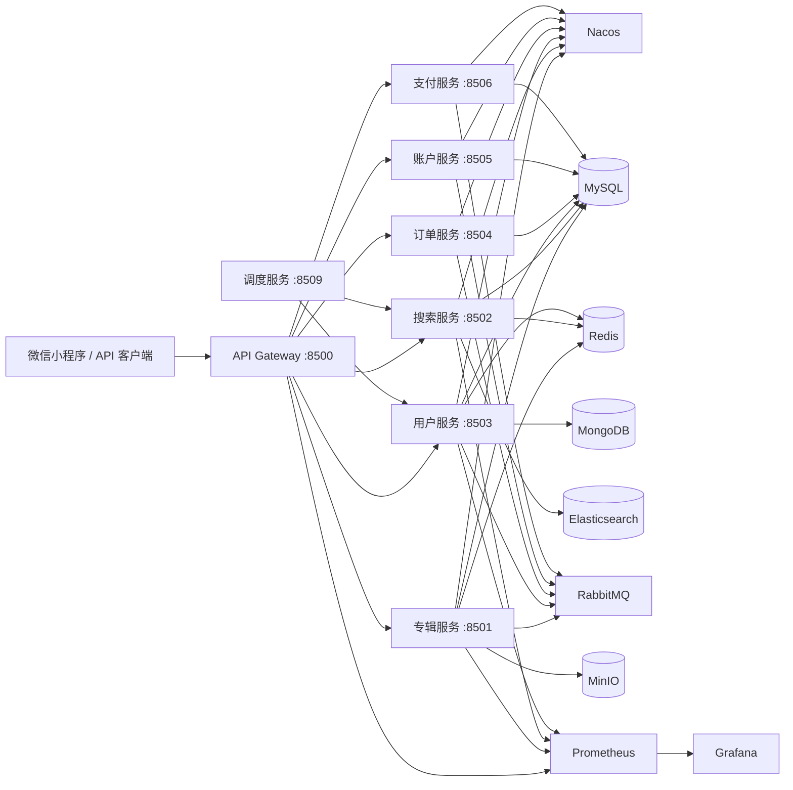

# 珞珈声场——面向高并发场景的数字内容微服务平台

Luojia Soundscape（珞珈声场）是一个基于 Java 17 与 Spring Cloud Alibaba 的数字内容订阅与分发平台。项目覆盖内容检索、专辑与声音、用户订阅/收藏、订单支付、排行榜和定时调度，工程重点是高并发读链路的性能与可用性治理。

## 系统架构



| 逻辑服务 | 端口 | 职责 |
|---|---:|---|
| `luojia-soundscape-gateway` | 8500 | 统一入口、路由和登录态传递 |
| `luojia-soundscape-album` | 8501 | 专辑、声音、分类、统计和媒体资源 |
| `luojia-soundscape-search` | 8502 | Elasticsearch 搜索、详情聚合和排行榜 |
| `luojia-soundscape-user` | 8503 | 登录、用户资料、订阅、收藏和收听记录 |
| `luojia-soundscape-order` | 8504 | 订单与交易编排 |
| `luojia-soundscape-account` | 8505 | 账户余额与账务记录 |
| `luojia-soundscape-payment` | 8506 | 支付流程与本地模拟支付 |
| `luojia-soundscape-dispatch` | 8509 | 排行榜和 VIP 周期任务 |

## 技术栈

- Java 17、Spring Boot 3.0.5、Spring Cloud 2022.0.2、Spring Cloud Alibaba
- MyBatis-Plus、MySQL、MongoDB、Redis、Redisson、Caffeine
- Elasticsearch、RabbitMQ、Nacos、OpenFeign、Seata、XXL-JOB
- MinIO、Micrometer、Prometheus、Grafana、k6
- Maven 多模块、GitHub Actions
- uni-app、Vue 3、TypeScript、Pinia、微信小程序

## 快速启动

### 1. 准备环境

本地需要安装 JDK 17、Maven 3.8+、Docker、Docker Compose、Git 和 curl。建议至少为 Docker 分配 6 GB 内存。

```bash
git clone https://github.com/hzk5/luojia-soundscape.git
cd luojia-soundscape
cp .env.example .env
```

编辑 `.env`，替换全部 `change-me`。本地 Compose 使用 MySQL root 连接多个 schema，因此 `MYSQL_PASSWORD` 应与 `MYSQL_ROOT_PASSWORD` 保持一致。微信登录需要填写自己的 `WECHAT_APP_ID` 和 `WECHAT_APP_SECRET`；仅浏览公开内容时可以先留空。

### 2. 启动基础设施

```bash
docker compose --env-file .env \
  -f deploy/docker/docker-compose.infrastructure.example.yml \
  up -d

docker compose --env-file .env \
  -f deploy/docker/docker-compose.infrastructure.example.yml \
  ps
```

首次创建 MySQL volume 时，`deploy/sql/` 中的业务库、Seata、Nacos 和 XXL-JOB 表会按文件名顺序自动初始化。已有同名 volume 时不会重复执行初始化脚本。

### 3. 发布 Nacos 配置

等待 Nacos 的 `8848` 端口就绪，然后执行：

```bash
chmod +x scripts/local/*.sh
./scripts/local/publish-nacos-config.sh
```

脚本会发布 `common.yaml` 以及网关和七个业务服务的 `*-dev.yaml`，事务服务会自动合并 Seata 客户端配置。Docker 快速启动模板仅在本机禁用 Nacos 鉴权；共享或生产环境必须启用鉴权并重新设置身份凭据。

打开 `http://127.0.0.1:9001`，使用 `.env` 中的 MinIO 账号创建 `luojia-soundscape` bucket；需要上传头像、封面或音频时，还要为该 bucket 配置合适的读取策略。

### 4. 启动后端

```bash
./scripts/local/start-all.sh --skip-infra
./scripts/local/status.sh
```

首次启动会执行 Maven 打包，然后依次启动专辑、搜索、用户、账户、订单、支付、调度和网关服务。运行日志位于 `.local-run/logs/`。

验证网关和基础接口：

```bash
curl -fsS http://127.0.0.1:8500/actuator/health
curl -fsS http://127.0.0.1:8500/api/album/category/getBaseCategoryList
```

代码没有变化时，可以跳过构建快速启动：

```bash
./scripts/local/start-all.sh --skip-build --skip-infra
```

停止 Java 服务：

```bash
./scripts/local/stop-all.sh
```

同时停止 Java 服务和基础设施容器：

```bash
./scripts/local/stop-all.sh --all
```

### 5. 启动微信小程序

```bash
cd frontend
cp .env.example .env.local
```

在 `manifest.json` 中填写自己的微信小程序 AppID，然后使用 HBuilderX 打开 `frontend/`，运行到微信开发者工具。默认 API 地址为 `http://127.0.0.1:8500`，详细说明见 [`frontend/README.md`](frontend/README.md)。

常用本地入口：

| 组件 | 地址 |
|---|---|
| API 网关 | `http://127.0.0.1:8500` |
| Nacos | `http://127.0.0.1:8848/nacos` |
| MinIO Console | `http://127.0.0.1:9001` |
| RabbitMQ Console | `http://127.0.0.1:15672` |
| XXL-JOB | `http://127.0.0.1:8080/xxl-job-admin` |

## 五项核心性能优化

### 1. 消除微服务 N+1 调用

订阅和收藏分页从“每条记录一次 Feign”改为“一次批量 Feign + 一次 SQL `IN`”。`BatchIdQuery` 负责去重、非空与 100 个 ID 上限，轻量 VO 降低跨服务载荷，内存回填保留 MongoDB 的原始顺序。

### 2. Caffeine + Redis 自适应二级缓存

统一 `CacheEnvelope` 承载新鲜期和陈旧期：L1 命中直接返回，L2 命中回填 L1，逻辑过期时先返回旧值并异步重建。冷 Key 通过 JVM `inFlight` 请求合并和 Redisson 分布式锁防止击穿，同时提供空值缓存、随机 TTL、锁内二次检查和 Redis 故障下的限流回源。

### 3. 跨实例缓存一致性

写入事务提交后删除 Redis 与当前 L1，再通过 RabbitMQ fanout 广播立即失效事件，1 秒后延迟双删，缩小并发读写回填旧值的窗口。每个实例使用独占自动删除队列清理本地 Caffeine。

### 4. 详情聚合与搜索热点缓存

专辑服务内部聚合专辑、统计和分类，搜索详情链路从 4 次远程调用降为 2 次，并保持外部 API 的四键响应兼容。热点详情和搜索查询使用短周期缓存，Feign 连接/读取超时收敛到 500/1500 ms。

### 5. 排行榜快照与线程池治理

排行榜用一次 Elasticsearch 聚合同时计算各分类下的 hot/play/subscribe/buy/comment 维度。新版本先完整写入 Redis Hash，再原子切换活跃指针，失败时保留上一快照。缓存刷新和索引同步使用独立、可配置、可观测的线程池，避免任务相互拖垮。

## 性能实测

固定 600 RPS 对照在同一机器、同一批 PERF 数据、同一预热和禁用链路追踪条件下进行：

| 指标 | 基线 | 优化后 | 改善 |
|---|---:|---:|---:|
| 整体 P95 | 29.14 ms | 11.59 ms | 60.23% |
| 专辑详情 P95 | 9.27 ms | 2.83 ms | 69.50% |
| 首页频道 P95 | 13.30 ms | 3.17 ms | 76.18% |
| 搜索 P95 | 6.53 ms | 3.09 ms | 52.71% |
| 订阅分页 P95 | 47.51 ms | 14.60 ms | 69.28% |
| 收藏分页 P95 | 63.53 ms | 14.18 ms | 77.69% |
| 完成请求数 | 36,000 | 36,001 | 对等 |
| 丢弃迭代 | 0 | 0 | 通过 |
| HTTP / 业务错误率 | 0% / 0% | 0% / 0% | 通过 |

公开读链路的阶梯 VU 测试中，QPS 从 1,837.75 提升至 9,271.90，整体 P95 从 141.03 ms 降至 21.54 ms，HTTP 错误率均为 0%。压测原始 JSON、运行日志和本地测试数据不进入仓库。

## 项目结构

```text
luojia-soundscape/
├── common/                  通用结果、AOP、缓存、日志、MQ 与线程池
├── model/                   领域对象、查询对象与 VO
├── service-client/          OpenFeign 内部契约与降级实现
├── service/                 业务微服务
├── server-gateway/          API 网关
├── frontend/                uni-app 微信小程序源码
├── deploy/sql/              脱敏 DDL 与必需基础字典
├── deploy/config/           Nacos/本地 profile 配置模板
├── deploy/docker/           基础设施 Compose 示例
├── ops/observability/       Prometheus 与 Grafana 模板
├── scripts/local/           本地启停脚本
├── scripts/perf/            PERF 数据、k6 与对比报告脚本
├── scripts/security/        源码与 Git 历史密钥扫描
└── .github/workflows/        CI 安全扫描与聚焦测试
```

Java 根包名为 `com.luojia.soundscape`，Maven 根坐标为 `com.luojia.soundscape:luojia-soundscape-parent:1.0`。

## 核心代码位置

| 主题 | 位置 |
|---|---|
| 二级缓存与并发合并 | `common/service-util/.../cache/SoundscapeCacheAspect.java` |
| 跨实例失效 | `common/rabbit-util/.../rabbit/service/CacheInvalidationService.java` |
| 批量 ID 契约 | `model/.../query/album/BatchIdQuery.java` |
| 订阅/收藏批量组装 | `service/service-user/.../service/impl/UserInfoServiceImpl.java` |
| 专辑详情聚合 | `service/service-album/.../service/impl/AlbumDetailServiceImpl.java` |
| 搜索详情聚合 | `service/service-search/.../service/impl/ItemServiceImpl.java` |
| 排行榜聚合与快照 | `SearchServiceImpl.java` 与 `RankingSnapshotStore.java` |
| 线程池治理 | `ThreadConfig.java` 与 `SearchExecutorConfig.java` |
| 可观测模板 | `ops/observability/` |
| 可重复压测 | `scripts/perf/` |
| 小程序源码 | `frontend/` |
| 数据库与配置模板 | `deploy/sql/` 与 `deploy/config/` |

上表省略部分目录前缀，可通过类名在 IDE 中直接定位。

## 本地运行所需组件

- JDK 17 与 Maven 3.8+
- MySQL 8、Redis、MongoDB、Elasticsearch
- RabbitMQ、Nacos、MinIO、XXL-JOB、Seata
- 可选：Prometheus 3.14.0、Grafana 13.2.2、k6 2.1.0

仓库提供 `scripts/local/start-all.sh` 与 `scripts/local/stop-all.sh`，用于统一管理本地 Java 服务。

GitHub 仓库提供的安全初始资料：

1. 从 [`.env.example`](.env.example) 创建本机 `.env`，所有凭据只在环境中填写。
2. 按 [`deploy/sql/README.md`](deploy/sql/README.md) 的顺序初始化全新 MySQL。
3. 以 [`deploy/config/`](deploy/config/) 中的文件创建 Nacos Data ID 或本地 profile。
4. 基础设施示例见 [`deploy/docker/`](deploy/docker/)。
5. 小程序说明见 [`frontend/README.md`](frontend/README.md)，`manifest.json` 的 AppID 默认留空。

配置与密钥约束：

- 仓库不保存数据库密码、Redis 密码、微信密钥、云密钥、token 或证书；
- Grafana 密码通过 `GRAFANA_ADMIN_PASSWORD` 注入；
- 本地签名密钥通过 `-Dsoundscape.sign-key` 或 `LUOJIA_SOUNDSCAPE_SIGN_KEY` 注入；
- 压测密码与 token 仅通过环境变量传入；
- `.gitignore` 排除 IDE、日志、运行目录、本地配置、监控数据、PERF manifest 和压测原始文件。
- 库中 SQL 不包含业务记录，Nacos/XXL-JOB 脚本不包含默认管理凭据。

## 项目来源与二次开发说明

本项目基于公开课程案例进行工程实践，并围绕二级缓存、远程调用批量化、详情聚合、排行榜快照、线程池治理、可观测性与压测体系完成性能二次开发。

珞珈声场为个人工程实践项目名称，不代表武汉大学官方项目或官方产品。

请同时阅读 [NOTICE.md](NOTICE.md)。
